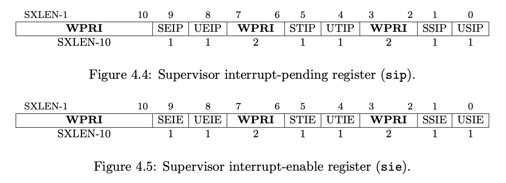
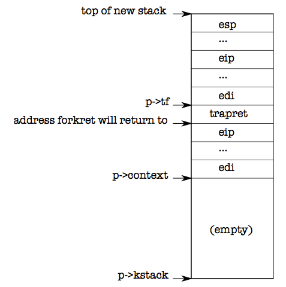
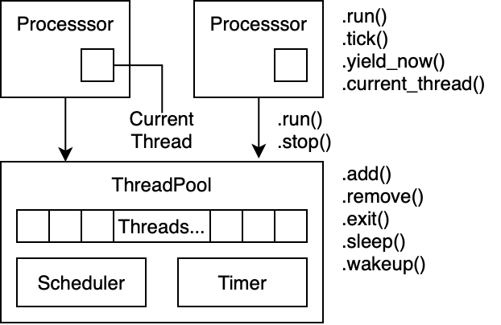

<!-- paginate: true -->

# rCore Tutorial

王润基、潘庆霖
清华大学计算机系

2019.12.15 @ OS2ATC

---

# rCore 项目介绍

* 初衷：尝试用 Rust 语言写 OS

* 始于：清华大学操作系统课 课程设计（2018春）
* 发展：在 OS 课大实验中普及推广（20+ 贡献者）
* 现状：
    * 兼容 Alpine Linux (musl libc)：Busybox, GCC, Nginx
    * 支持四种指令集：x86_64, ARM64, RISC-V, MIPS32

---

## 开源开放


https://github.com/rcore-os
http://os.cs.tsinghua.edu.cn/oscourse/OS2019spring/projects

---

## Rust OS 相关工作

* Redox OS：完成度最高的微内核 OS

* CS140e：Stanford 实验性课程，Rust OS for Raspi3
* Tock OS：Stanford 嵌入式操作系统，充分利用 Rust 特性
* RVirt：MIT RISC-V Hypervisor
* Writing an OS in Rust —— BlogOS：详尽的 Rust OS 教程

---

## Rust 在产业界的应用情况

* 蚂蚁金服：Occlum（SGX LibOS）

* 百度：Rust SGX SDK
* 字节跳动：高性能服务端
* PingCAP：TiKV 高性能分布式数据库
* Facebook：Libra

---

## 为什么用 Rust？

C 语言的两大问题：

* 内存不安全
* 缺少现代语言特性和好用的工具链

C++？
* 功能强大但难以驾驭
* 坑比 C 更多！

Go？
* 运行时比较重
* GC！

---

### Rust 的主要特性

* 内存+线程安全

* 高层语言特性
* 友好的工具链
* 蓬勃发展的社区生态

---

## Rust 开发内核的优势

* 内存安全，无畏并发

* 充分利用 Rust 生态

* 实现可复用的内核模块，可以灵活组合出不同 OS

---

# rCore Tutorial (step by step)

从零开始，一步一步带你用 Rust 在 RISC-V 平台上写 OS

* 初衷：降低初学者门槛，普及 Rust，推广 rCore

* 始于：操作系统课（2019春）
* 作者：清华计算机系本科生
* 目标：「写 OS 不难！」

---

## 为什么用 RISC-V？

* 开源开放的指令集

* 简单！没有历史包袱

* 降低了 OS 开发难度

* 促进软硬件协同设计

---

## rCore_tutorial的最终成果？

**用一个 shell 运行简单的用户程序！**

```
$ make run
...
Rust user shell
>> rust/hello_world
searching for program rust/hello_world
Hello world! from user mode program!
thread 1 exited, exit code = 0
>> 
```

---

## 需要实现哪些功能？

* 基础执行环境：Bootloader

* 基本输入输出：串口驱动，中断处理
* 管理内存：物理内存分配，虚拟内存映射（页表）
* 管理任务：线程切换，进程资源管理
* 从文件加载程序：简单文件系统

---

# rCore Tutorial 提纲

1. 独立可执行程序
2. 最小化内核
3. 中断
4. 物理内存管理
5. 虚拟内存管理
6. 内核线程
7. 线程调度
8. 用户进程
9. 文件系统

---

## 实验环境

* 【本地】Docker
    ```sh
    git clone https://github.com/rcore-os/rCore_tutorial
    cd rCore_tutorial
    make docker
    ```

* 【在线】实验楼
    https://www.shiyanlou.com/courses/1481
    验证码：wfkblCQp

---

## 先修要求

* 具有 计算机组成原理 和 操作系统 基础知识
* 了解 RISC-V 指令集
* 初步 Rust 语言基础
* 对原理的好奇心 和 造轮子的热情！

---

# 第一章：独立式可执行程序

目标：用 Rust 生成裸机程序

步骤：

* 建立 Rust 开发环境
* 创建 Rust 项目
* 移除标准库依赖

---

## 1.1 安装 Rust 工具链

```sh
$ curl https://sh.rustup.rs -sSf | sh
```

* rustup：工具链管理器
* cargo：项目和包管理器
* rustc：编译器

---

### Rust Nightly

Rust 的三个版本：Stable，Beta，Nightly

**开发 OS 需要使用 nightly**，因为要用到一些不稳定功能。
**使用 nightly 需要锁定日期**，因为不保证 ABI 兼容性。

### 项目配置

创建 `rust-toolchain` 文件：

```
nightly-2019-12-08
```

以后只要在这个目录下使用 Rust 时，
都会自动切换到这个版本的工具链。

---

## 1.2 创建 Rust 项目

```sh
$ cargo new os --bin
```

目录结构：

```
os
├── Cargo.toml     项目配置文件
└── src            源代码路径
    └── main.rs    源程序
```

运行程序：

```sh
$ cargo run
   ...
Hello, world!
```

---

## 1.3 移除标准库 std

Rust 内置的几个重要的库：
* std 标准库：默认使用，依赖 OS (libc)
* core 核心库：语言相关特性
* alloc 库：动态内存分配

为了生成裸机程序，需要移除 std。

我们的 OS 使用 core 和 alloc。

---

## 1.3 移除标准库 std

```rust
#![no_std]
```

出现若干编译错误：（为什么？）
1. `println!`：输出需要 syscall 支持
2. `panic_handler`：panic 处理函数
3. `eh_personality`：panic 后 unwind 栈
4. `start`：crt0 中的 `_start` 入口点

依次修复……

---

## 1.4 小结

用 `objdump` 查看生成的裸机程序：

```
target/debug/os：     文件格式 elf64-x86-64

Disassembly of section .text:

0000000000000310 <_start>:
 310:	eb 00                	jmp    312 <_start+0x2>
 312:	eb fe                	jmp    312 <_start+0x2>
```

---

# 第二章：最小化内核

目标：构建一个最小的 RISC-V 内核

步骤：

* 使用**目标三元组**描述目标平台
* 进行**交叉编译**并查看生成的可执行文件
* 使用**链接脚本**指定内存布局
* 使用 **OpenSBI** 作为 bootloader 运行内核
* 使用 SBI 接口**格式化输出字符串**

---

## 2.1 目标三元组

Rust 工具链自带交叉编译功能

Rust 使用 **目标三元组（target triple）** 描述目标平台

格式：`cpu-vendor-os-abi`
* `x86_64-unknown-linux-gnu`
* `x86_64-apple-darwin`
* **`riscv64imac-unknown-none-elf`**

Rust 自带了一些配置，可以使用以下命令查看：
```sh
rustc --print target-list
```

---

### JSON 描述文件

目标三元组**使用 JSON 格式描述**

可以使用以下命令查看：
```sh
rustc -Z unstable-options --print target-spec-json
  --target x86_64-unknown-linux-gnu
```

```json
{
    "llvm-target": "x86_64-unknown-linux-gnu",
    "data-layout": "e-m:e-i64:64-f80:128-n8:16:32:64-S128",
    "arch": "x86_64",
    "target-endian": "little",
    "target-pointer-width": "64",
    "target-c-int-width": "32",
    "os": "linux",
    "executables": true,
    "linker-flavor": "gcc",
    "pre-link-args": ["-m64"],
    "morestack": false,
    ...
}
```

---

## 2.2 编译、生成内核镜像

指定 target 进行交叉编译：
```sh
$ cargo build --target riscv64imac-unknown-none-elf
```

解决错误：安装预编译 libcore
```sh
$ rustup target add riscv64imac-unknown-none-elf
```

编译结果位于：
`target/riscv64imac-unknown-none-elf/debug/os`

---

### 设置默认目标三元组

创建 Cargo 配置文件 `.cargo/config`：
```toml
[build]
target = "riscv64imac-unknown-none-elf"
```

此后可以直接 `cargo build`

---

### 安装 binutils 工具集

binutils: objdump, objcopy, strip, nm ...

【推荐】安装 `cargo-binutils`：使用内置 LLVM 工具链

```sh
$ cargo install cargo-binutils
$ rustup component add llvm-tools-preview
```

【可选】安装 GNU 工具链：
* SiFive 网站：https://www.sifive.com/boards#software
* musl.cc：https://musl.cc, https://mac.musl.cc

---

### 查看生成的可执行文件

`target/riscv64imac-unknown-none-elf/debug/os`

```
$ file os
os: ELF 64-bit LSB executable, UCB RISC-V, version 1 (SYSV), 
statically linked, with debug_info, not stripped
```

```
$ rust-objdump -x --arch-name=riscv64 os 

os:    file format ELF64-riscv

architecture: riscv64
start address: 0x0000000000011000

Sections: ...

SYMBOL TABLE: ...

Program Header: ...
```

---

### 查看生成的可执行文件

查看反汇编：

```
$ rust-objdump -d --arch-name=riscv64 os

os:    file format ELF64-riscv

Disassembly of section .text:

0000000000011000 _start:
   11000: 41 11           addi    sp, sp, -16
   11002: 06 e4           sd    ra, 8(sp)
   11004: 22 e0           sd    s0, 0(sp)
   11006: 00 08           addi    s0, sp, 16
   11008: 09 a0           j    2
   1100a: 01 a0           j    0
```

---

### 生成镜像文件（bin）

```sh
$ rust-objcopy os --strip-all -O binary kernel.bin
```

---

## 2.3 用链接脚本指定内存布局

编译出的程序默认被放到了从 0x10000 开始的位置上：
```
start address: 0x0000000000011000
...
Program Header:
    PHDR off    0x0000000000000040 vaddr 0x0000000000010040 ...
    LOAD off    0x0000000000000000 vaddr 0x0000000000010000 ...
    LOAD off    0x0000000000001000 vaddr 0x0000000000011000 ...
   STACK off    0x0000000000000000 vaddr 0x0000000000000000 ...
```

因为普通用户程序位于低地址空间。

但是：
* OS 内核一般都在高地址空间上
* RISC-V 内存的物理地址从 0x80000000 开始

因此我们需要调整内存的起始地址。

---

### 链接脚本

程序的内存布局在**链接时**确定，
使用 **链接脚本（linker script）** 进行配置。

创建链接脚本 `src/boot/linker64.ld`：
```
OUTPUT_ARCH(riscv)
ENTRY(_start)

BASE_ADDRESS = 0x80200000;

SECTIONS
{
    . = BASE_ADDRESS;
    start = .;

    ...
}
```

---

### 链接脚本

```
SECTIONS
{
    .text : {
        stext = .;
        *(.text.entry)
        *(.text .text.*)
        . = ALIGN(4K);
        etext = .;
    }
    .rodata : {...}
    .data : {...}
    .stack : {...}
    .bss : {...}

    PROVIDE(end = .);
}
```

---

### 使用链接脚本

在 `.cargo/config` 中加入：

```toml
[target.riscv64imac-unknown-none-elf]
rustflags = [
    "-C", "link-arg=-Tsrc/boot/linker64.ld",
]
```

给链接器传入参数 `-T` 来指定使用哪个链接脚本。

---

### 查看新的链接结果

```
$ cargo build
...
$ rust-objdump os -h --arch-name=riscv64
...
Sections:
Idx Name          Size     VMA          Type
  0               00000000 0000000000000000 
  1 .text         00001000 0000000080200000 TEXT 
  2 .rodata       00000000 0000000080201000 TEXT 
  3 .data         00000000 0000000080201000 TEXT 
  4 .bss          00000000 0000000080201000 BSS
...
$ rust-objdump os -d --arch-name=riscv64
...
0000000080200000 stext:
80200000: 41 11          addi    sp, sp, -16
80200002: 06 e4          sd    ra, 8(sp)
80200004: 22 e0          sd    s0, 0(sp)
80200006: 00 08          addi    s0, sp, 16
80200008: 09 a0          j    2
8020000a: 01 a0          j    0
        ...
```

---

## 2.4 重写程序入口点

### 程序的启动过程

* 用户程序：
  * OS 将 PC 置为 `_start` 所在地址
  * `_start` 位于 `crt0.S`，初始化 libc 后跳转到 `main`

* 操作系统：
  * 上电后 PC 置为 BIOS/ROM 固定地址
  * BIOS 自检后，跳转到 Bootloader
  * Bootloader 将 OS 加载到内存，跳转到 OS

---

### RISC-V 的特权级 和 QEMU 启动过程


* PC 从 0x80000000 开始执行，处于 M-Mode

* Bootloader (OpenSBI) 进行各种初始化，
  跳转到固定地址 0x80200000，同时切换到 S-Mode

* OS 的第一条指令位于 0x80200000

---

### 重写程序入口点 _start

新建一个汇编文件 `src/boot/entry64.asm`：

```
    .section .text.entry
    .globl _start
_start:                     # 位于 0x80200000
    la sp, bootstacktop     # 加载栈指针
    call rust_main          # 跳转到 Rust 入口函数

    .section .bss.stack
    .align 12               # 按页(4K)对齐
    .global bootstack
bootstack:
    .space 4096 * 4         # 分配 16KB 空间用作栈
    .global bootstacktop
bootstacktop:
```

---

### 重写程序入口点 _start

改写 Rust 代码 `main.rs`：

```rust
#![feature(global_asm)]

global_asm!(include_str!("boot/entry64.asm"));

#[no_mangle]
pub extern "C" fn rust_main() -> ! {
    loop {}
}
```

使用 `global_asm!` 在全局嵌入上述汇编代码

---

### 看看现在程序的样子

```
0000000080200000 stext:
80200000: 17 51 00 00       auipc   sp, 5
80200004: 13 01 01 00       mv      sp, sp
80200008: 97 00 00 00       auipc   ra, 0
8020000c: e7 80 80 00       jalr    8(ra)

0000000080200010 rust_main:
80200010: 41 11             addi    sp, sp, -16
80200012: 06 e4             sd      ra, 8(sp)
80200014: 22 e0             sd      s0, 0(sp)
80200016: 00 08             addi    s0, sp, 16
80200018: 09 a0             j       2
8020001a: 01 a0             j       0
```

---

## 2.5 使用 QEMU 运行内核

### 安装 QEMU

* Linux(Ubuntu)：下载源码编译
    ```sh
    $ wget https://download.qemu.org/qemu-4.1.1.tar.xz
    $ tar xvJf qemu-4.1.1.tar.xz
    $ cd qemu-4.1.1
    $ ./configure --target-list=riscv32-softmmu,riscv64-softmmu
    $ make -j
    $ export PATH=$PWD/riscv32-softmmu:$PWD/riscv64-softmmu:$PATH
    ```

* macOS：直接从 Homebrew 下载
    ```sh
    $ brew install qemu
    ```

确保版本在 4.1.0 及以上。

---

### 使用 OpenSBI

新版 QEMU 中内置了 OpenSBI，使用以下命令运行一下：

```sh
$ qemu-system-riscv64 \
> --machine virt \
> --nographic \
> --bios default

OpenSBI v0.4 (Jul  2 2019 11:53:53)
   ____                    _____ ____ _____
  / __ \                  / ____|  _ \_   _|
 | |  | |_ __   ___ _ __ | (___ | |_) || |
 | |  | | '_ \ / _ \ '_ \ \___ \|  _ < | |
 | |__| | |_) |  __/ | | |____) | |_) || |_
  \____/| .__/ \___|_| |_|_____/|____/_____|
        | |
        |_|

Platform Name          : QEMU Virt Machine
Platform HART Features : RV64ACDFIMSU
Platform Max HARTs     : 8
Current Hart           : 0
Firmware Base          : 0x80000000
Firmware Size          : 112 KB
Runtime SBI Version    : 0.1

PMP0: 0x0000000080000000-0x000000008001ffff (A)
PMP1: 0x0000000000000000-0xffffffffffffffff (A,R,W,X)
```

---

### 完整构建过程

```makefile
target := riscv64imac-unknown-none-elf
mode := debug
kernel := target/$(target)/$(mode)/os
bin := target/$(target)/$(mode)/kernel.bin

objdump := rust-objdump --arch-name=riscv64
objcopy := rust-objcopy --binary-architecture=riscv64

run: build qemu
build: $(bin)
$(bin): kernel
    $(objcopy) $(kernel) --strip-all -O binary $@
kernel:
    cargo build
asm:
    $(objdump) -d $(kernel) | less
qemu:
    qemu-system-riscv64 \
        -machine virt \
        -nographic \
        -bios default \
        -device loader,file=$(bin),addr=0x80200000
clean:
    cargo clean
```

---

### 输出点儿啥

```rust
#![feature(asm)]

// 在屏幕上输出一个字符，目前我们先不用了解其实现原理
pub fn console_putchar(ch: u8) {
    unsafe {
        asm!("ecall"
             :: "{x10}" (ch as usize), "{x17}" (1)
             : "memory" : "volatile"
        );
    }
}

#[no_mangle]
extern "C" fn rust_main() -> ! {
    // 在屏幕上输出 "OK\n" ，随后进入死循环
    console_putchar(b'O');
    console_putchar(b'K');
    console_putchar(b'\n');
    loop {}
}
```

---

### 运行结果 & Demo

```
...
PMP0: 0x0000000080000000-0x000000008001ffff (A)
PMP1: 0x0000000000000000-0xffffffffffffffff (A,R,W,X)
OK
```

---

## 2.6 封装 SBI 接口

### RISC-V 软件栈


* SEE: Supervisor Execution Environment
    OpenSBI 还在 M-Mode 继续运行，为上层软件提供服务

* SBI: Supervisor Binary Interface
    S-Mode 与 M-Mode 之间的二进制接口
    通过 `ecall` 指令调用

---

### Rust 内联汇编

```rust
#[inline(always)]
fn sbi_call(
    which: usize, arg0: usize, 
    arg1: usize, arg2: usize,
) -> usize {

    let ret;
    unsafe {
        asm!("ecall"
            : "={x10}" (ret)
            : "{x10}" (arg0), "{x11}" (arg1), 
              "{x12}" (arg2), "{x17}" (which)
            : "memory"
            : "volatile");
    }
    ret
}
```

和 C 语言语法基本一样

---

### 封装 SBI 接口

```rust
pub fn set_timer(stime_value: u64) {
    sbi_call(SBI_SET_TIMER, stime_value as usize, 0, 0);
}
pub fn console_putchar(ch: usize) {
    sbi_call(SBI_CONSOLE_PUTCHAR, ch, 0, 0);
}
pub fn console_getchar() -> usize {
    sbi_call(SBI_CONSOLE_GETCHAR, 0, 0, 0)
}

const SBI_SET_TIMER: usize = 0;
const SBI_CONSOLE_PUTCHAR: usize = 1;
const SBI_CONSOLE_GETCHAR: usize = 2;
```

---

## 2.7 格式化输出

还记得一开始的 `println!` 吗？

希望在输出单个字符的基础上，实现格式化输出字符串。

```rust
println!("Hello {}: {:?}", "rCore", Ok(1));
```
```
Hello rCore: Ok(1)
```

---

### Rust 核心库中的格式化输出流程

通过宏生成 格式描述对象 `Arguments`
* `println!("{}", 1)`
* => `format_args!("{}", 1)`
* => `core::fmt::Arguments`

借助 trait `core::fmt::Write` 输出单个字符
* `stdout.write_fmt(arguments)`
* => `stdout.write_str(&str)`

注：不需要动态内存分配（alloc）

---

### 实现 trait `Write`

Trait `core::fmt::Write` 中实现了格式化输出逻辑：

```rust
pub trait Write {
    fn write_str(&mut self, s: &str) -> Result;
    fn write_char(&mut self, c: char) -> Result {...}
    fn write_fmt(&mut self, args: Arguments) -> Result {...}
}
```

只需实现 `write_str`，即可使用 `write_fmt`：

```rust
struct Stdout;
impl fmt::Write for Stdout {
    fn write_str(&mut self, s: &str) -> fmt::Result {
        for ch in s.chars() {
            sbi::console_putchar(ch as u8 as usize);
        }
        Ok(())
    }
}
```

---

### 包装一层宏

```rust
// src/io/mod.rs

pub fn _print(args: fmt::Arguments) {
    Stdout.write_fmt(args).unwrap();
}

#[macro_export]
macro_rules! print {
    ($($arg:tt)*) => ({
        $crate::io::_print(format_args!($($arg)*));
    });
}
```

Rust 宏功能强大，语法也比较复杂，在此不详细介绍。

---

### 释放格式化输出的威力吧！

改写 panic 处理函数，输出相关信息：

```rust
#[panic_handler]
fn panic(info: &PanicInfo) -> ! {
    println!("{}", info);
    loop {}
}
```

---

## 第二章小结：Demo 

```rust
#[no_mangle]
pub extern "C" fn rust_main() -> ! {
    extern "C" { fn _start(); }
    println!("_start vaddr = {:#x}", _start as usize);
    println!("Hello world!");
    panic!("You want to do nothing!");
    loop {}
}
```

```sh
_start vaddr = 0x80200000
Hello world!
panicked at 'You want to do nothing!', src/init.rs:15:5
```

---

# 第三章：中断

目标：正确处理中断和异常

步骤：

* 了解 RISC-V 中断流程和相关寄存器
* 设置中断处理函数，手动触发断点中断
* 保存和恢复上下文（TrapFrame）
* 设置和响应时钟中断

---

## 3.1 RISC-V 中断处理流程

相关寄存器：

* `sepc`：发生中断的指令地址
* `scause`：中断发生的原因
* `stval`：中断相关值，例如缺页异常时的目标地址
* `stvec`：中断向量地址和模式
* `sstatus`：全局状态寄存器，设置中断开关

相关指令：

* `ecall`：实现向高特权级的系统调用
* `ebreak`：触发断点中断
* `sret`：从 S 态中断返回

---

### 中断时都发生了什么

发生中断或异常时：
* `sepc` 被置为当前 PC，PC 被重置为 `stvec`
* `scause` `stval` 中保存相关状态和值
* 切换到高特权级，`sstatus` 中保存相关状态：
    * `SPIE`：发生中断前是否开中断
    * `SPP`：发生中断前的特权级（S/U）

从 `sret` 恢复时：
* PC被重置为 `sepc`
* 从 `sstatus` 中恢复状态：
    * `SPIE`：决定是否打开中断
    * `SPP`：决定回到哪个特权级

---

## 3.2 设置中断处理函数

首先在 `Cargo.toml` 中导入一个库 `riscv`：
```toml
[dependencies]
riscv = { 
    git = "https://github.com/rcore-os/riscv", 
    features = ["inline-asm"] 
}
```

这个库包装了对 RISC-V CSR 寄存器的访问接口。

---

### 建立中断处理函数，设置中断向量

```rust
// src/interrupt.rs

use riscv::registers::*;

pub fn init() {
    unsafe {
        stvec::write(
            trap_handler as usize, 
            stvec::TrapMode::Direct,
        );
    }
    println!("++++ setup interrupt! ++++");
}

fn trap_handler() -> ! {
    let cause = scause::read().cause();
    let epc = sepc::read();
    println!("trap: cause: {:?}, epc: {:#x}", cause, epc);
    panic!("trap handled!");
}
```

---

### 手动触发断点异常

```rust
#[no_mangle]
pub extern "C" fn rust_main() -> ! {
    crate::interrupt::init();
    unsafe {
        asm!("ebreak" :::: "volatile");
    }
    panic!("end of rust_main");
}
```

运行结果：
```
++++ setup interrupt! ++++
trap: cause: Exception(Breakpoint), epc: 0x0x80200022
panicked at 'trap handled!', src/interrupt.rs:20:5
```

---

## 3.3 保存和恢复上下文环境

当中断发生时，仅 PC 被重置到内核处理函数的位置，
其它 32 个通用寄存器都保持不变。

由于执行内核代码会破坏掉这些寄存器状态，
我们需要在中断处理之前保存它们，
并在中断处理结束后恢复它们。

---

### 中断帧

一般中断前的上下文环境被保存在内核栈上，
称为 **中断帧（TrapFrame）**

它的内容和内存布局如下：

```rust
#[repr(C)]                  // 按 C 语言标准布局
#[derive(Debug)]            // 自动生成格式化输出代码
pub struct TrapFrame {
    pub x: [usize; 32],     // 通用寄存器
    pub sstatus: Sstatus,   // 中断前状态
    pub sepc: usize,        // 中断位置
    pub stval: usize,       // 中断相关值
    pub scause: Scause,     // 中断原因
}
```

---

### 使用汇编代码保存和恢复上下文

创建汇编文件 `src/trap/trap.asm`：

```
    .section.text
    .globl __alltraps
    .globl __trapret
__alltraps:         // 中断处理入口点
    SAVE_ALL        // TODO：保存到栈上
    mv a0, sp       // 将 TrapFrame 指针作为函数参数
    call rust_trap  // 进入 Rust 处理函数
__trapret:
    RESTORE_ALL     // TODO：从栈上恢复
    sret            // 中断返回
```

在 Rust 中导入全局汇编：

```rust
global_asm!(include_str!("trap/trap.asm"));

#[no_mangle]
pub fn rust_trap(tf: &mut TrapFrame) {...}
```

---

### 使用汇编代码保存和恢复上下文

提示：
* 接下来几段汇编非常精妙
* 需要仔细思考才能理解
* 如果赶时间可以跳过

---

### 保存上下文

遇到了棘手的问题：如何切换栈？

* 中断发生前，CPU 可能处于 S-Mode 或 U-Mode，
  对应的 `sp` 分别指向 内核栈 或 用户栈。
* 中断发生后，希望 `sp` 切换到 内核栈。

但 RISC-V 没有 x86 中断时**硬件自动切换栈**的机制！

我们要解决的问题：
* 如何在**不破坏 32 个通用寄存器**的前提下，
  判断中断**来自用户态还是内核态**，并**切换到内核栈**上？

---

### 判断中断来源，切换到内核栈

【技巧】使用 `sscratch` 寄存器

我们规定：
* 当 CPU 处于 S-Mode 时，`sscratch` 保存 0
* 当 CPU 处于 U-Mode 时，`sscratch` 保存 内核栈

三行魔法指令：
```asm
__alltraps:
    csrrw sp, sscratch, sp    # 交换 sp, sscratch
    bnez sp, trap_from_user   # 如果sp非0，那么来自用户态
trap_from_kernel:             # 如果来自内核……
    csrr sp, sscratch         #   sp = sscratch（读回原值）
trap_from_user:               # 从这里开始 sp 指向内核栈
    ...
```

---

### 保存 通用寄存器 和 特殊寄存器

```
trap_from_user:
    # 提前分配栈帧
    addi sp, sp, -36*8
    # 按顺序保存除 x0(zero), x2(sp) 之外的寄存器
    STORE x1, 1
    STORE x3, 3
    ...
    STORE x31, 31
    # sscratch 为发生中断前的 sp
    # 将 sscratch 的值保存在 s0 中，并将 sscratch 清零
    csrrw s0, sscratch, zero
    # 分别将四个寄存器的值保存在 s1,s2,s3,s4 中
    csrr s1, sstatus
    csrr s2, sepc
    csrr s3, stval
    csrr s4, scause
    # 将 sp 和特殊寄存器保存在栈上
    STORE s0, 2
    STORE s1, 32
    STORE s2, 33
    STORE s3, 34
    STORE s4, 35
```

---

### 恢复上下文

完全相反的过程，不再赘述，请参考代码

### 新的中断初始化

```rust
extern "C" {
    fn __alltraps();
}
// 当前处于内核态，sscratch 初始化为 0
sscratch::write(0);

// 设置入口点为 __alltraps
stvec::write(__alltraps as usize, stvec::TrapMode::Direct);
```

---

### 处理断点异常

```rust
#[no_mangle]
pub fn rust_trap(tf: &mut TrapFrame) {
    println!("rust_trap!");
    tf.sepc += 2;   // 跳过 ebreak 指令
}
```

注意：在开启 **压缩指令集扩展（C）** 的情况下，
`ebreak` 指令占 2 字节。

```
80200022: 02 90            ebreak
80200024: 17 35 00 00      auipc   a0, 3
```

---

### 运行结果

成功处理了断点异常，并恢复执行：

```
++++ setup interrupt! ++++
rust_trap!
panicked at 'end of rust_main', src/init.rs:9:5
```

---

## 3.4 时钟中断

由定时器固定时间间隔触发的中断。

内核使用时钟中断，定期从用户态夺取控制权。

进而实现 时间片轮转（Round Robin）等调度算法。

---

### RISC-V 中断相关寄存器



* `sie`：不同类型中断的开启状态（Enable）
* `sip`：不同类型中断的等待状态（Pending）
* `sstatus.SIE`：中断总开关

---

### 时钟中断处理流程

调用 `sbi_set_timer` 设置下一次时钟中断的时间，
同时标志此次中断处理完毕。

```rust
/// 响应此次时钟中断，并设置下次中断的时间
pub fn clock_set_next_event() {
    sbi::set_timer(time::read() + TIMEBASE);
}
/// 触发时钟中断的时间间隔
static TIMEBASE: u64 = 100000;
```

### 开启时钟中断

```rust
sstatus::set_sie();     // 开启中断总开关
sie::set_stimer();      // 开启时钟中断
clock_set_next_event(); // 设置下次时钟中断
```

---

### 补充中断处理函数
```rust
#[no_mangle]
pub fn rust_trap(tf: &mut TrapFrame) {
    // 根据中断原因分类讨论
    match tf.scause.cause() {
        Trap::Exception(Exception::Breakpoint)
            => breakpoint(&mut tf.sepc),
        Trap::Interrupt(Interrupt::SupervisorTimer)
            => timer(),
        _ => panic!("undefined trap!"),
    }
}

fn timer() {
    clock_set_next_event();
    static mut TICKS: usize = 0;    // 记录中断次数
    unsafe {
        TICKS += 1;
        if (TICKS % 100 == 0) {     // 每100次输出一条信息
            println!("* 100 ticks *");
        }
    }
}
```

---

## 第三章小结：Demo

```
++++ setup interrupt! ++++
++++ setup timer!     ++++
a breakpoint set @0x8020002c
panicked at 'end of rust_main', src/init.rs:11:5
* 100 ticks *
* 100 ticks *
...
```

--- 

# 第四章：内存管理

目标：

* 能够按页分配物理内存

* 能够进行动态内存分配，使用 alloc 库中的容器
  例如：`Box`, `Vec`, `BTreeMap`...

---

## 4.1 物理内存探测

### 标准做法

* 物理内存信息硬编码在 DeviceTree 中

* 内核解析 DeviceTree，获取物理内存信息

* 内核利用物理内存信息，初始化内存管理子系统

---

### rCore Tutorial 做法 

* QEMU 环境：给定一片连续内存

* 采取 QEMU 默认配置：128MB

* 内核中硬编码内存边界为 0x88000000
  初始化内存管理子系统

---

## 4.2 物理页帧分配器

* 探测得到的物理内存交给物理页帧分配器统一进行页式内存管理

* rCore Tutorial 给出了一个简单的实现（线段树）

* 读者能够自行尝试其他连续内存分配算法

---

## 4.3 堆内存管理

* Rust编译器支持用户手动**实现**+**指定**堆内存分配器

* 编译时静态分配堆所需内存，运行时堆存在于bss段

* 引入buddy system算法的实现，来管理堆内存分配

```rust
use buddy_system_allocator::LockedHeap;

#[global_allocator]
static ALLOCATOR: LockedHeap = LockedHeap::empty();
```

--- 

# 第五章：虚拟内存管理

目标：建立和管理虚拟内存映射

步骤：

* RISC-V 虚拟内存机制：Sv39
* 建立初始虚存映射
* 实现三级页表
* MemSet：更灵活的虚存管理

--- 

## 5.1 RISC-V 三级页表简介

Sv39三级页表

* 39位虚拟地址 ----> 56位物理地址

* 标准页为4KB大小（2^12)，支持2M（2^21）、1G（2^30)大页

* 页表大小为一个标准页，可容纳512(2^9)个8Byte大小的页表项

---

### 虚实地址


---

### 页表项及其标志位说明


---

## 5.2 建立初始虚存映射

* 假定内核大小不超过1G

* 将 [0xffffffffc0000000, 0xffffffffffffffff]
  映射到 [0x80000000,0xc0000000)

* 只需：

  * 修改第3级页表的第 0x1ff 项指向 0x80000000

  * 并设置该项管理内容为 1G 大页

--- 

### 好处和不足

* 初始页表实现简单便捷

* 虚拟内存权限管理一视同仁，非常危险！

---

## 5.3 实现三级页表

维护一个Sv39页表需要的操作：

* 维护第三级页表所在的物理页帧地址

* 映射、取消映射虚拟页和物理页：
  
  * 多次读取页表内容、定位下一级页表位置

  * 可能进行物理页帧分配和回收

---

### riscv 库中页表的实现

依赖我们已经封装好的riscv底层库中的页表组件

* 对应内存布局为4KB大小的页表及相关操作

* 对应内存布局为8Byte的页表项及相关基础操作

---

封装逻辑上的页表项和三级页表，实现对应操作

```rust
pub struct PageEntry(&'static mut PageTableEntry, Page);

pub struct PageTableImpl {
    page_table: Rv39PageTable<'static>,
    // 作为根的三级页表所在的物理页帧
    root_frame: Frame,
    // 在操作过程中临时使用
    entry: Option<PageEntry>,
}
```

---

实现需要的操作（举例）

```rust
pub fn map(&mut self, va: usize, pa: usize) -> &mut PageEntry {
    // 为一对虚拟页与物理页帧建立映射

    // 这里的标志位被固定为 R|W|X，即同时允许读/写/执行
    // 后面我们会根据段的权限不同进行修改
    let flags = EF::VALID | EF::READABLE | EF::WRITABLE;
    let page = Page::of_addr(VirtAddr::new(va));
    let frame = Frame::of_addr(PhysAddr::new(pa));
    self.page_table
        // 利用 Rv39PageTable 的 map_to 接口
        // 传入要建立映射的虚拟页、物理页帧、映射标志位、以及提供物理页帧管理
        .map_to(page, frame, flags, &mut FrameAllocatorForPaging)
        .unwrap()
        // 得到 MapperFlush(Page)
        // flush 做的事情就是跟上面一样的 sfence_vma
        // 即刷新与这个虚拟页相关的 TLB
        // 所以我们修改后有按时刷新 TLB
        .flush();
    self.get_entry(va).expect("fail to get an entry!")
}
```

--- 

## 5.4 MemSet：更灵活的虚存管理

* 对于一个程序（包括内核），.text、.data、.bss等段应该有不一样的访问权限！

* 各段应该分别映射，统一管理

* 将每一个段看作一个 `MemArea`
  `MemSet`: a set of `MemArea`

---

### 各对象间的关系 


---

### MemoryHandler

实现具体映射策略，例如：
* 立即映射
* 延迟映射
* 映射到文件


---

## 5.5 重新映射内核

* 初始映射中，我们将这个内核一起映射，各个段读/写/执行的权限相同

* 进入Rust代码的世界之后，创建一个MemSet用于管理内核的各个段的映射

---

# 第六章：内核线程

目标：实现内核线程的创建和切换

步骤：

* 线程状态的描述
* 线程切换（Context Switch）
* 构造新线程

---

## 6.1 线程状态的描述

* 寄存器状态
* 栈内容

```rust
pub struct Thread {
    pub context: Context,
    pub kstack: KernelStack,
}
```

---

### 内核栈

在堆上分配一段空间作为内核栈：

```rust
use alloc::alloc::*;

pub struct KernelStack(usize);
pub const KSTACK_SIZE: usize = 0x4000;
const KSTACK_LAYOUT: Layout = unsafe {
    Layout::from_size_align_unchecked(KSTACK_SIZE, KSTACK_SIZE)
};
impl KernelStack {
    pub fn new() -> Self {
        let bottom = unsafe { alloc(KSTACK_LAYOUT) as usize };
        KernelStack(bottom)
    }
}
impl Drop for KernelStack {
    fn drop(&mut self) {
        unsafe { dealloc(self.0 as _, KSTACK_LAYOUT); }
    }
}
```

---

### 寄存器状态

```rust
/// 线程上下文内容
#[repr(C)]              // 确定内存布局
pub struct ContextContent {
    ra: usize,          // PC
    satp: usize,        // 页表地址
    s: [usize; 12],     // callee-saved 寄存器
    tf: TrapFrame,      // 用于构造新线程
}

pub struct Context {
    content_addr: usize,    // 栈底指针
}
```

Q：为何不用保存 caller-saved 寄存器？

---

## 6.2 上下文切换

线程切换的核心是 **上下文切换（Context Switch）**：
* 保存当前线程寄存器（到当前线程栈上）
* 恢复目标线程寄存器（从目标线程栈上）

---

### 如何实现上下文切换

将过程封装成函数。

从一个线程的视角看来，是进行了一次函数调用：
```rust
// 进入函数：切换到其它线程执行
current.context.switch_to(&mut target.context);
// 函数返回：从其它线程切换回来
```

---

### 剖开函数内部：魔法汇编！

保存上下文：

```
# switch_to(&mut current.sp, &mut target.sp)
switch_to:
    # 在当前栈上分配空间
    addi sp, sp, -14*XLENB
    # 更新 current.sp
    sd sp, 0(a0)
    # 依次保存 s0-s11
    sd ra, 0*8(sp)
    sd s0, 2*8(sp)
    ...
    sd s11, 13*8(sp)
    # 保存 satp
    csrr s11, satp
    sd s11, 1*8(sp)
    # 当前线程状态保存完毕
```

---

恢复上下文（完全相反）：

```
    # 读取 target.sp
    ld sp, 0(a1)
    # 恢复页表寄存器 satp，别忘了使用屏障指令 sfence.vma 刷新 TLB
    ld s11, 1*8(sp)
    csrw satp, s11
    sfence.vma
    # 依序恢复各寄存器
    ld ra, 0*8(sp)
    ld s0, 2*8(sp)
    ...
    ld s11, 13*8(sp)
    # 回收当前栈上的空间
    addi sp, sp, 14*XLENB
    # 将 target.sp 置为 0（标记正在运行）
    sd zero, 0(a1)
    # 回到切换线程前的位置继续执行
    ret
```

---

## 6.3 构造新的线程

设想新的线程是从运行状态切换下来的，
它的栈上会有哪些内容？

我们可以在栈上精心构造一个上下文结构体，
使得经过 `switch_to` 操作后恢复出一个新线程。


---

### 在栈上构造初始内容



---

### 线程对象的构造函数

```rust
impl Thread {
    // 创建一个新线程，放在堆上
    pub fn new_kernel(entry: usize) -> Box<Thread> {
        let kstack = KernelStack::new();
        Box::new(Thread {
            context: unsafe { Context::new_kernel_thread(...) },
            kstack,
        })
    }
}
```

---

## 第六章小结：Demo

```sh
I'm leaving soon, but I still want to say: Hello world!
switched back from temp_thread!
```

---

# 第七章：线程调度

目标：支持多线程管理和调度

步骤：
* 线程相关对象
* 实现调度线程
* 调度算法

---

## 7.1 线程相关对象的设计



* `ThreadPool`：管理所有线程的容器
* `Processor`：线程执行器，对应一个 CPU 核
* `Scheduler`：调度器，决定接下来执行哪一个

---

## 7.2 调度线程

作为 `Processor` 的主循环：

* 从 `ThreadPool` 取出一个线程
* 切换上下文到目标线程
* 线程执行
* 线程调用 `yield` 函数，切换回调度线程
* 将线程放回 `ThreadPool`

如果此时没有可执行线程：
* 打开中断并停机 （`wfi`）
* 等待下一个中断到来，恢复执行

---

```rust
impl Processor {
    pub fn schedule_main(&self) -> ! {
        loop {
            // 如果从线程池中获取到一个可运行线程
            if let Some(thread) = inner.pool.acquire() {
                // 将自身的正在运行线程设置为刚刚获取到的线程
                inner.current = Some(thread);
                inner.idle.switch_to(
                    &mut *inner.current.as_mut().unwrap().1
                );
                // 此时 current 还保存着上个线程
                let (tid, thread) = inner.current.take().unwrap();
                // 通知线程池这个线程需要将资源交还出去
                inner.pool.retrieve(tid, thread);
            }
            // 如果现在并无任何可运行线程
            else {
                // 打开异步中断，并等待异步中断的到来
                enable_and_wfi();
                // 异步中断处理返回后，关闭异步中断
                disable_and_store();
            }
        }
    }
}
```

---

## 7.3 调度算法

也就是 **就绪队列**。

保存所有可执行的线程，询问下一个执行哪个线程？

具体算法：
* FIFO：先来的先执行
* Round Robin：时间片轮转
* Stride：依据优先级计算步长
* ……

---

### 调度器接口

```rust
pub trait Scheduler {
    // 如果 tid 不存在，表明将一个新线程加入线程调度
    // 否则表明一个已有的线程要继续运行
    fn push(&mut self, tid: Tid);

    // 从若干可运行线程中选择一个运行
    fn pop(&mut self) -> Option<Tid>;

    // 时钟中断中，提醒调度算法当前线程又运行了一个 tick
    // 返回的 bool 表示调度算法认为当前线程是否需要被切换出去
    fn tick(&mut self) -> bool;

    // 告诉调度算法一个线程已经结束
    fn exit(&mut self, tid: Tid);
}
```

---

## 7.4 测试多线程调度

新线程执行函数：
```rust
#[no_mangle]
pub extern "C" fn hello_thread(arg: usize) -> ! {
    println!("begin of thread {}", arg);
    // 输出足够多次，使得有机会发生线程切换
    for i in 0..800 {
        print!("{}", arg);
    }
    println!("\nend  of thread {}", arg);
    // 通知 CPU 结束当前线程
    CPU.exit(0);
    unreachable!()
}
```

---

初始化：

```rust
pub fn init() {
    // 使用 Round Robin Scheduler
    let scheduler = RRScheduler::new(1);
    // 新建线程池
    let thread_pool = ThreadPool::new(100, Box::new(scheduler));
    // 新建 idle 线程
    let idle = Thread::new_kernel(Processor::idle_main as usize);
    // 我们需要传入 CPU 的地址作为参数
    idle.append_initial_arguments([&CPU as *const Processor as usize, 0, 0]);
    // 初始化 CPU
    CPU.init(idle, Box::new(thread_pool));

    // 依次新建 5 个内核线程并加入调度单元
    for i in 0..5 {
        CPU.add_thread({
            let thread = Thread::new_kernel(hello_thread as usize);
            // 传入一个编号作为参数
            thread.append_initial_arguments([i, 0, 0]);
            thread
        });
    }
    println!("++++ setup process!   ++++");
}
```

---

运行结果示例：

```
>>>> will switch_to thread 0 in idie_main!
begin of thread 0
0000000000000000000000000000000000000...
<<<< switch_back to idle in idle_main!

>>>> will switch_to thread 1 in idie_main!
begin of thread 1
1111111111111111111111111111111111111...
<<<< switch_back to idle in idle_main!

...

>>>> will switch_to thread 0 in idie_main!
000000000000000000
end  of thread 0
thread 0 exited, exit code = 0

<<<< switch_back to idle in idle_main!
```

---

# 第八章：用户进程

目标：从 ELF 加载用户程序并运行，能够输出字符串

步骤：
* Rust 用户程序框架
* 实现系统调用
* 解析 ELF 文件并创建虚拟内存
* 创建用户进程

---

### 用户程序模型

* 与内核具有同样target的no_std程序

* 内核提供简单的系统调用：字符输出、程序退出

* 编译成ELF文件，内核负责加载、运行

---

### 实现系统调用

类似在内核中 `ecall` 调用 SBI 函数：

```rust
#[inline(always)]
fn sys_call(
    syscall_id: SyscallId,
    arg0: usize, arg1: usize,
    arg2: usize, arg3: usize,
) -> i64 {
    let id = syscall_id as usize;
    let mut ret: i64;
    unsafe {
        asm!(
            "ecall"
            : "={x10}"(ret)
            : "{x17}"(id), "{x10}"(arg0), 
              "{x11}"(arg1), "{x12}"(arg2), "{x13}"(arg3)
            : "memory"
            : "volatile"
        );
    }
    ret
}
```

---

内核中的系统调用实现：

```rust
// src/interrupt.rs

fn syscall(tf: &mut TrapFrame) {
    // 返回后跳转到 ecall 下一条指令
    tf.sepc += 4;
    let ret = crate::syscall::syscall(
        tf.x[17],
        [tf.x[10], tf.x[11], tf.x[12]],
        tf
    );
    tf.x[10] = ret as usize;
}

pub fn syscall(id: usize, args: [usize; 3], tf: &mut TrapFrame) -> isize {
    match id {
        SYS_WRITE => { print!("{}", args[0] as u8 as char); 0 },
        SYS_EXIT => { sys_exit(args[0]); 0 },
        _ => panic!("unknown syscall id {}", id),
    }
}
```

---

### 如何链接用户程序

* 还未实现文件系统，无法将用户程序保存在磁盘中

* 编译内核时将用户程序链接到某一位置

* 创建进程时，内核认为用户代码位于内存中的特定位置

---

### 如何链接用户程序

```rust
fn main() {
    println!("cargo:rerun-if-env-changed=USER_IMG");
    if let Ok(user_img) = std::env::var("USER_IMG") {
        println!("cargo:rerun-if-changed={}", user_img);
    }
    gen_link_user_asm().unwrap();
}

/// Generate assembly file for linking user image
fn gen_link_user_asm() -> Result<()> {
    let mut f = File::create("src/link_user.S").unwrap();
    let user_img = std::env::var("USER_IMG").unwrap();

    writeln!(f, "# generated by build.rs - do not edit")?;
    writeln!(f, r#"
    .section .data
    .global _user_img_start
    .global _user_img_end
_user_img_start:
    .incbin "{}"
_user_img_end:
"#, user_img)?;
    Ok(())
}
```

---

### 如何链接用户程序

```rust
// init.rs

global_asm!(include_str!("link_user.S"));
```

---

### 管理用户程序的资源

* 虚拟内存资源

* CPU计算资源

---

### 管理虚拟内存资源：MemSet

* 将程序的各个段按照不同的读/写/执行权限进行管理

---

#### 管理CPU资源：进程分时调度

---

# 总结 & Demo

---

# rCore 贡献者名单

### 指导教师

陈渝，向勇

### rCore Tutorial

刘丰源，潘庆霖，吴一凡，王润基

### rCore OS

王润基，陈嘉杰，贾越凯，陈晟祺，周聿浩，
刘丰源，潘庆霖，郭敬哲，陶东来，苏明贤，霍江浩，
高天宇，王晓智，孙桢波，黄冰鉴，康鸿博，石雨松，
张译仁，吴一凡，戴臻旸，王纪霆，寇明阳，孔彦，
刘辰屹，陈秋昊，朱书聪
